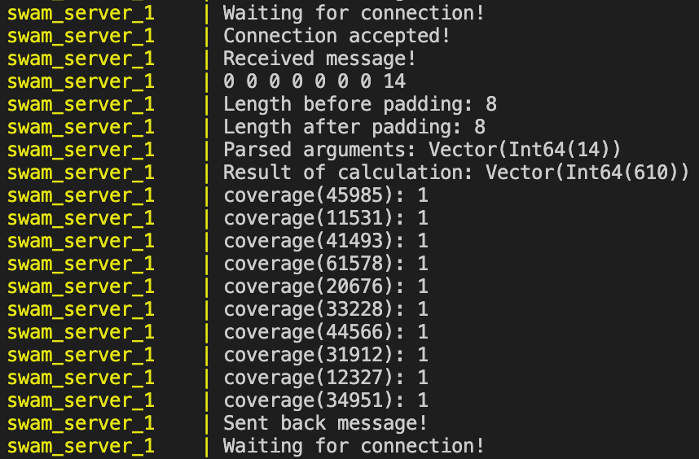
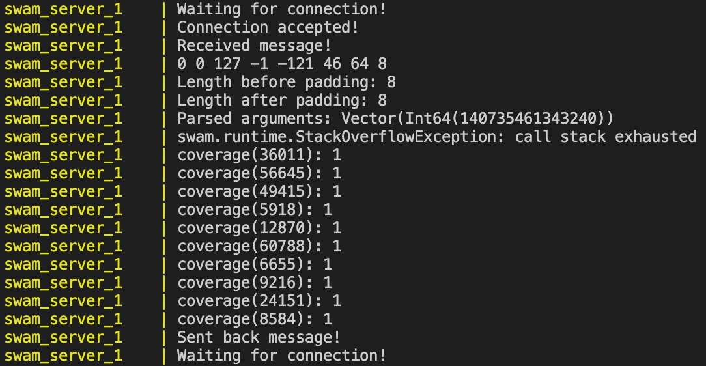

# AFL Plugin for SWAM

## Disclaimer

This is still in a prototyping stage. There are still many assumptions made on how AFL (and C++ and Scala and shared memory) works. Also, the coverage tool on which this plugin depends is currently still being developed.

## Introduction

This plugin aims to act as an interface between SWAM and AFLplusplus. Since AFL is built to fuzz C++ programs, but nonetheless provides a generic algorithm, which is not only bound to this language, we aim to provide a spin-off that applies AFL to WASM binaries.

In the standard AFL setup, C++ source code is compiled using the C++-compiler provided by AFLplusplus (afl-clang-fast++), which "instruments" the code to do additional operations during run-time. The instrumentation that AFL's compiler usually injects into the target source code includes accessing a shared memory, which serves as a communication channel between AFL and the resulting binary. This channel is used to report the coverage data of each execution to AFL, so that AFL can make smarter decisions on the upcoming input parameters.

In our case, we are given a WASM binary and an interpreter built with Scala - in other words, no code that we can instrument with afl-clang-fast++. The workaround we provide to deal with this problem, is that we have built an interface (interface.cpp), which fakes the behaviour of the instrumented binary and instead forwards the fuzzed inputs given by AFL to the SWAM engine via a socket. The SWAM engine then in turn forwards it to the instantiated WASM function. By hard-coding the instrumentation into the interface, we can use the "standard" g++ compiler to compile it.

In SWAM, code coverage is handled in the package 'optin'. The socket server for SWAM on the other hand, is found in the package 'cli' and is executed with `mill cli.runserver <args>`. The cli makes use of the 'optin' package and returns the coverage results including an exit code of the WASM file through the socket. Interface.cpp then parses this data and feeds the content into the shared memory used by AFL. Even though AFL provides modes to work without using coverage data from executions it has triggered (see qemo mode), it is more efficient when provided it.

## Parsing AFL's fuzzed inputs

One major difference between C++ and WASM is that WASM only works with Int32/int, Int64/long, Float32/float and Float64/double. This matters, since AFL most commonly takes a config file as an input parameter, which is then first parsed from chars/strings to the corresponding type by the C++ code. Since a WASM function cannot simply receive a char or string and parse it to the int/long/float/double it needs, we need to do this manually beforehand.

To do this, we explicitly specify what argument types are required by the WASM function in the ./env file and also pass corresponding initial test parameters that work (also in the ./env file). We can then use the prepare_wasm_input.cpp file to write these initial input parameters into an input file with the correct bit representation. By reading this file at the beginning of the execution, the interface is also aware of how many bytes are exactly required by the WASM function, which helps when sending the correct data size towards the server socket or printing output. Furthermore, since the way AFL finds errors in the code is by flipping "random" bits in the config file, these bits need to be preserved without any changes when they are forwarded to SWAM through the socket.

Since the argument types for the WASM function are written as environmental variables, we can also parse them before initialising the SWAM socket server. The server then also knows exactly how to interpret the incoming bytes and how to feed them to the instantiated WASM function.

## Optimisations

### Done

1. **#SPEED**: SWAM is continuously running. It is not required to re-boot the JVM for every socket message it receives.

1. **#SPEED**: The SWAM socket server only instantiates the given WASM file/function once. Executing the instantiated function when receiving a message through the socket is equivalent to executing a fixed Scala function in the source code.

1. **#PORTABILITY**: Both the SWAM engine and AFLplusplus are dockerized in two separate containers and are given a corresponding docker-compose.fuzzing.yml setup. All required configuration is to be found in fuzzing/.env.

### To Do

1. **#SPEED**: Currently, the socket server is working synchronously and is incapable of handling multiple requests at the same time. There is also no setup built yet for multiple AFL instances to share the same output and work concurrently either.

## Requirements

To be able to run this on your machine, only Docker is required. If you want to test SWAM's socket server without AFL, see the main page of this repository on how to set up SWAM.

## Test SWAM's socket server with sample input (for fibo.wat)

1. Start the SWAM socket server. We want to run the "naive" function in the fibo.wat file. Since the function takes one long/Int64 as an input parameter, we need to specify this with the "--argType" option.

    ```bash
    mill -i cli.run run_server --wat --argType Int64 --main naive --out ./ <path_to_repo>/examples/docs/fibo.wat
    ```

1. Start socket client and communicate input/output with server

    ```bash
    ./run_test.sh
    ```

## Run

1. Configure ./.env file

2. Execute docker-compose configuration

    ```bash
    docker-compose -f docker-compose.fuzzing.yml up --build
    ```

3. View ./logs/ for own logs and ./out/ for AFL output

## Example logs for fibo.wat with docker-compose configuration

The following the Docker logs of the SWAM server

1. receiving and parsing a message

2. calculating the instantiated WASM function (clever fibonacci) with the received inputs

3. gathering the coverage of the execution (currently still entirely random)

4. sending back the coverage along with the exit code

Fibonacci working           |  Fibonacci failing (number too high)
:-------------------------:|:-------------------------:
 | 

In the case of running fibo.wat, a lot of crashes are registered by AFL, since essentially any "high" number causes the call stack to exhaust, which is not accounted for by the function in fibo.wat.

## Credits

- Initial idea and implementation (for Java): [Kelinci](https://github.com/isstac/kelinci)
