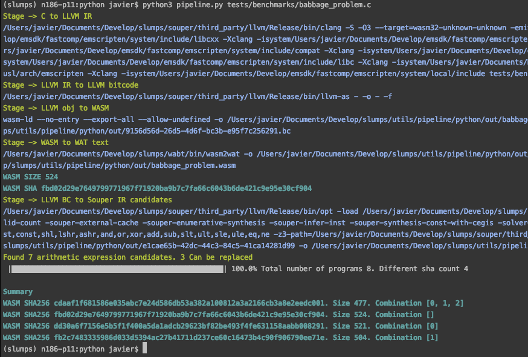

#  SLUMPs 

*Research on randomization and superoptimization for WebAssembly WASM*

Given a C program, SLUMPs repurposes a superoptimizer ([Souper](https://github.com/google/souper)) to output several equivalent WASM programs.
For each optimization candidate from Souper, we generate a new WASM program, as we show in the image below.



## Prerequisites

- Python version 3.7

- Download our changed version of Souper. The main reason behind is that we include some extra options to be able of working together with the SLUMPs core. After downloading all the submodules in SLUMPs, build every one of them following the respective instructions in the original repos.

    Inside the `souper` folder:

    ```bash
    ./build_deps.sh
    mkdir build
    cd build
    cmake  ../
    make
    ```

- Build wabt toolkit to provide the WASM to WAT conversion for debugging reasons.

    Follow this instructions inside the `wabt` folder:

    ```bash
    git submodule update --init
    mkdir build
    cd build
    cmake ..
    cmake --build .
    ```

- Install the python requirements: `pip3 install -r src/requirements.txt`

## Troubleshooting

- **SLUMPs shows a fail in the CLANG step**: Install emscripten and run it as follows `emcc -v <file>.c`. Then copy all the include files in the [include](https://github.com/KTH/slumps/blob/18ef5189904e25019155fe305046f4b5b8907538/src/settings/config.ini#L17) configuration for SLUMPs.
- **SLUMPs shows a fail connecting to REDIS**: Install Redis in your local pc and ensure that its running, or change the usage of external cache in the Souper [config](https://github.com/KTH/slumps/blob/18ef5189904e25019155fe305046f4b5b8907538/src/settings/config.ini#L58).
- **SLUMPs doesn't find the souper folder**: Check the [path](https://github.com/KTH/slumps/blob/18ef5189904e25019155fe305046f4b5b8907538/src/settings/config.ini#L2) in the settings file
- **SLUMPs fails in the souper opt pass**: Check the [name](https://github.com/KTH/slumps/blob/18ef5189904e25019155fe305046f4b5b8907538/src/settings/config.ini#L48) for the souper pass (for instance, the extension for Ubuntu can be different to the Mac one).

## Config options

- **Optimization subset strategy**: [generator-method](https://github.com/KTH/slumps/blob/18ef5189904e25019155fe305046f4b5b8907538/src/settings/config.ini#L9) = subset | onexone | all

- **Output only different binaries**: [prune-equal](https://github.com/KTH/slumps/blob/18ef5189904e25019155fe305046f4b5b8907538/src/settings/config.ini#L6), we calculate the sha256 value for evey WASM program, then we keep only the programs with different sha values.

Change the remaining values to get different results, for instance, add extra arguments to the CLANG step.

## How to use it

Run `python3  src/slumps.py <file.c>` or run it directly on LLVM IR (the 'wasm32-unknown-unknown' target needs to be used during compilation) `python3 src/slumps.py <file.ll>`

### Docker images

To run slumps in an easy way, we provide a Docker image which contains the plumping to work with Souper (our modest changed version), binaryen and wabt.
To build it, run: `docker build -t slumps:backend -m 8g -f Dockerfile .` inside the docker_images folder. 

If the LLVM build takes to long or fails due to memory lack in the image building:
    >  Increase memory and/or CPU ressources in the docker engine configuration

### Slumps dockerized app

The application can be ported to a docker container too. To do so, enter in the src file and build the docker image. Run the following command to start the application ```docker run -it -v $(pwd)/<logs>:/slumps/src/logs -v $(pwd)/<code to process folder>:/input -v $(pwd)/<out folder>:/slumps/src/out -e TIMEOUT=3600 slumps:app```. Slumps will process every code in the input volumen folder exporting the results to the out folder volumen. You can specify the timeout per program in seconds, set the environment variable ```TIMEOUT``` to do it.

## Study of memory disclosure vulnerabilities

[Slides](https://jacarte.github.io/wasm_presentation/)

## Souper new features

We added some features/options to Souper:

- **`souper-subset`**: Based on the candidate indexes, specify the candidates to be applied, for example
`-souper-subset=1,2,3,4` or `-souper-subset=0,3`
- **`souper-valid-count`**: Search for successful optimizations without replacing
- **`souper-redis-host`**: Host for redis
- **`souper-redis-pass`**: Password for redis connection


## Issues

- Candidates overlapping. For example, in the `bitwise_IO` problem there are only 36 different programs:
    `Total number of programs 2048. Different sha count 36. Pruned count 2012`

- LLVM frontend for WASM: This will provide the WASM -> WASM behavior in SLUMPs
