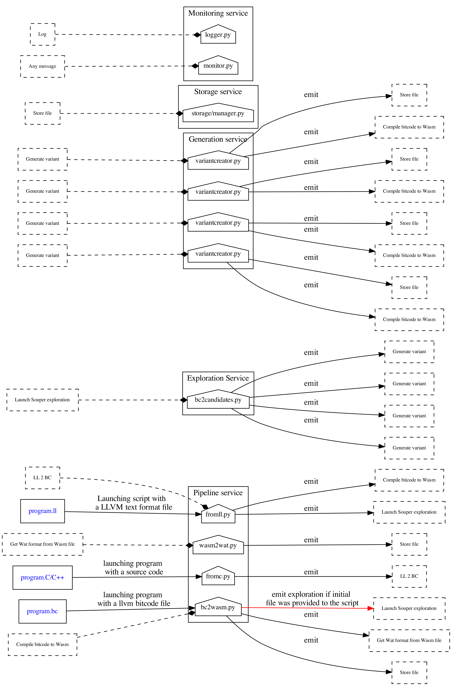

#  CROW 

CROW is a superdiversitifer for WASM. The reference explanation is in paper [CROW: Code Diversification for WebAssembly](http://arxiv.org/pdf/2008.07185).

```bibtex
@inproceedings{crow,
 title = {CROW: Code Diversification for WebAssembly},
 author = {Javier Cabrera Arteaga and Orestis Floros Malivitsis and Oscar Luis Vera Pérez and Benoit Baudry and Martin Monperrus},
 booktitle = {Proceedings of MadWEB},
 year = {2021},
}
```

## General architecture



TODO

## Repo structure

TODO

## Prerequisites

- Python version 3.7


- Download our changed version of Souper. The main reason behind is that we include some extra options to be able of working together with the SLUMPs core. After downloading all the submodules in SLUMPs, build every one of them following the respective instructions in the original repos.

    Inside the `souper` folder:

    ```bash
    ./build_deps.sh
    mkdir build
    cd build
    cmake  ../
    make
    ```

- Build wabt toolkit to provide the WASM to WAT conversion for debugging reasons.

    Follow this instructions inside the `wabt` folder:

    ```bash
    git submodule update --init
    mkdir build
    cd build
    cmake ..
    cmake --build .
    ```

- Install the python requirements: `pip3 install -r  crow/requirements.txt`

- RabbitMQ broker: `docker run -d --hostname my-rabbit --name some-rabbit --restart always -p 5672:5672 -p 8080:15672 rabbitmq:3-management
`

## Troubleshooting

- **CROW shows a fail in the CLANG step**: Install emscripten and run it as follows `emcc -v <file>.c`. Then copy all the include files in the [include](https://github.com/KTH/slumps/blob/18ef5189904e25019155fe305046f4b5b8907538/src/settings/config.ini#L17) configuration for CROW.
- **CROW shows a fail connecting to REDIS**: Install Redis in your local pc and ensure that its running, or change the usage of external cache in the Souper [config](https://github.com/KTH/slumps/blob/18ef5189904e25019155fe305046f4b5b8907538/src/settings/config.ini#L58).
- **CROW doesn't find the souper folder**: Check the [path](https://github.com/KTH/slumps/blob/18ef5189904e25019155fe305046f4b5b8907538/src/settings/config.ini#L2) in the settings file


## How to use it

TODO

## Configuration options

TODO

### Docker images

To run CROW in an easy way, we provide a Docker image which contains the plumping to work with Souper (our modest changed version), binaryen and wabt.
To build it, run: `docker build -t slumps/backend:latest -m 8g -f Dockerfile` inside the docker_images folder. 

If the LLVM build takes to long or fails due to memory lack in the image building:
    >  Increase memory and/or CPU ressources in the docker engine configuration

### CROW dockerized app

- `docker run -it --rm --entrypoint="/bin/bash" slumps/crow2 ./launch_standlane.sh  <options>`: Launch all CROW services as a standalone docker container

#### Horizontal scalation

- `docker run -it --rm --entrypoint="/bin/bash" slumps/crow2 ./launch_generators.sh  <number of workers> <options>`: Launch only the generator services
- `docker run -it --rm --entrypoint="/bin/bash" slumps/crow2 ./launch_entrypoints.sh  <options>`: Launch only the entrypoints service
- `docker run -it --rm --entrypoint="/bin/bash" slumps/crow2 ./launch_exploration.sh  <options>`: Launch only the exploration service
- `docker run -it --rm --entrypoint="/bin/bash" slumps/crow2 ./launch_logger.sh  <options>`: Launch only the logger service
- `docker run -it --rm --entrypoint="/bin/bash" slumps/crow2 ./launch_monitor.sh <options>`: Launch only the monitor service
- `docker run -it --rm --entrypoint="/bin/bash" slumps/crow2 ./launch_storage.sh  <options>`: Launch only the storage service
