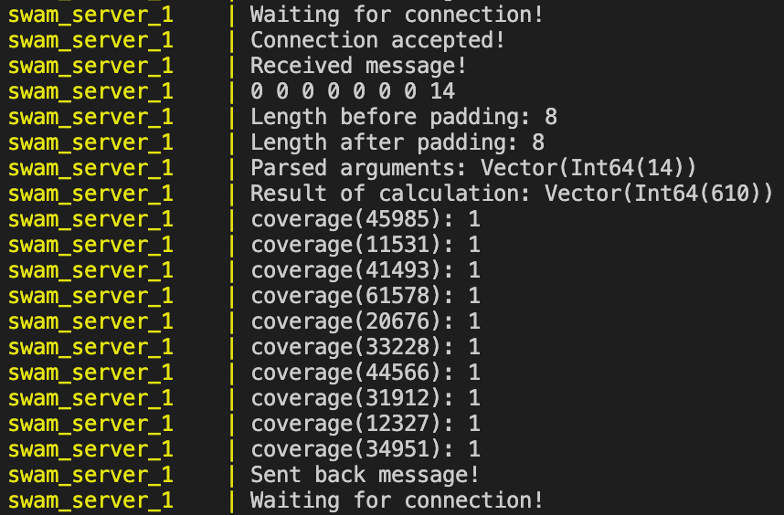
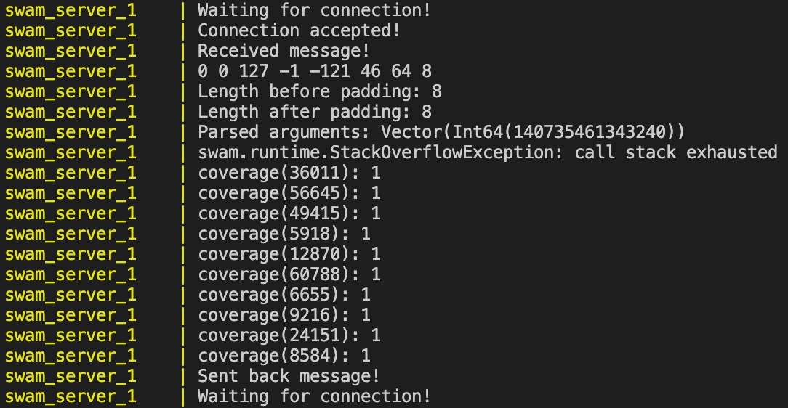

# WAFL - Fuzz your WASM with AFLplusplus

## Disclaimer

This is still in a prototyping stage. There are still many assumptions made on how AFL (and C++ and Scala and shared memory) works. Also, SWAM's coverage functionality on which this tool depends is currently still being developed.

## Introduction

This tool aims to act as an interface between [SWAM](https://github.com/satabin/swam) and [AFLplusplus](https://github.com/AFLplusplus/AFLplusplus). Whilst SWAM is a Scala interpreter for WebAssembly, AFL is a fuzzing tool for C++ programs. Since AFL provides a generic fuzzing algorithm which is not necessarily bound to C++, we aim to provide a spin-off that applies it to WASM binaries.

In the standard AFL setup, C++ source code is compiled using the C++ compiler provided by AFLplusplus (afl-clang-fast++), which "instruments" the code to do additional operations during run-time. The instrumentation that AFL's compiler usually injects into the target source code includes accessing a shared memory, which serves as a communication channel between AFL and the resulting binary. This channel is used to report the coverage data of each execution to AFL, so that AFL can make smarter decisions on the upcoming input parameters.

In our case, we are given a WASM binary and an interpreter built with Scala - in other words, no code that we can instrument with afl-clang-fast++. The workaround we provide to deal with this problem, is that we have built an interface (interface.cpp), which fakes the behaviour of the instrumented binary and instead forwards the fuzzed inputs given by AFL to the SWAM engine via a socket. The SWAM engine then in turn forwards it to the instantiated WASM function. By hard-coding the instrumentation into the interface, we can use the "standard" g++ compiler to compile it.

In SWAM, code coverage is handled in the package 'optin'. The socket server for SWAM on the other hand, is found in the package 'cli' and is executed with `mill cli.runserver <args>`. The cli makes use of the 'optin' package and returns the coverage results including an exit code of the WASM file through the socket. Interface.cpp then parses this data and feeds the content into the shared memory used by AFL. Even though AFL provides modes to work without using coverage data from executions it has triggered (see qemo mode), it is more efficient when provided it.

Right now, we support fuzzing of four data types as function parameter:

* int32
* int64
* float32
* float 64

## Parsing AFL's fuzzed inputs

One major difference between C++ and WASM is that WASM only works with Int32/int, Int64/long, Float32/float and Float64/double. This matters, since AFL most commonly takes a config file as an input parameter, which is then first parsed from chars/strings to the corresponding type by the C++ code. Since a WASM function cannot simply receive a char or string and parse it to the int/long/float/double it needs, we need to do this manually beforehand.

To do this, we explicitly specify what argument types are required by the WASM function in the ./env file and also pass corresponding initial test parameters that work (also in the ./env file). We can then use the ./fuzzing-client-afl/prepare_wasm_input.cpp file to write these initial input parameters into an input file with the correct bit representation. By reading this file at the beginning of the execution, the interface is also aware of how many bytes are exactly required by the WASM function, which helps when sending the correct data size towards the server socket or printing output. Furthermore, since the way AFL finds errors in the code is by flipping "random" bits in the config file, these bits need to be preserved without any changes when they are forwarded to SWAM through the socket.

Since the argument types for the WASM function are written as environmental variables, we can also parse them before initialising the SWAM socket server. The server then also knows exactly how to interpret the incoming bytes and how to feed them to the instantiated WASM function.

## Requirements

To be able to run this on your machine, only Docker is required. If you want to test SWAM's socket server without AFL, see ./fuzzing-server-swam on how to install SWAM.

## Configuration

All configuration options are visible in the .env file. This is where you specify which .wasm/.wat file & function you want to be fuzzing and of what types it's input parameters are. Furthermore, it requires to provide a set of working input parameters, which are used in AFL test-runs and can be regarded as AFL's "seed" to random input.

## Using docker-compose

### Building

This tool creates two Docker containers, as specified in the docker-compose.base.yml file - one for the SWAM socket server (Dockerfile in ./fuzzing-server-swam) and one for the AFL socket client (Dockerfile in ./fuzzing-client-afl). The only configuration parameters to building this are currently the SCALA_VERSION and the MILL_VERSION in SWAM's Dockerfile. Nonetheless, it should not be required to change these parameters as they are fitted to the code of this repostory.

How to build:

```bash
docker-compose -f docker-compose.base.yml -f docker-compose.yml build
```

#### Mechanics of SWAM's Dockerfile

We are not using the standard base image for the Scala Mill Build Tool [(nightscape/scala-mill)](https://hub.docker.com/r/nightscape/scala-mill/dockerfile), since it uses an older version of Scala and Mill. Our Dockerfile is however strongly based on theirs.

Mill currently does not provide any command to [simply install dependencies without compiling the source code](https://stackoverflow.com/questions/62834693/mill-build-tool-install-dependencies-without-compiling-source-code). Compiling the source code is done with `mill <package_name>.compile` and the reason why this is not included in the Dockerfile is to avoid the overhead of downloading all the same dependencies everytime source code is altered. The current workaround is to store the compiled sources along with the dependencies in volumes, which can be accessed during runtime and are specified in the docker-compose.base.yml file ("compiled_sources" & "maven_data"). SWAM's compilation is therefore delayed to the entrypoint (./entrypoint_mill_server.sh) and is encompassed in the `mill -i cli.run run_server <args>` command.

#### Mechanics of AFL's Dockerfile

This image uses the [official image of AFLplusplus](https://hub.docker.com/r/aflplusplus/aflplusplus/) as a base, which contains the full configuration of AFL pre-installed. It then builds the C++ files of this folder with the standard Ubuntu g++ compiler (not the one provided by AFL). The C++ files are therefore not instrumented. The resulting executables are later accessed during run-time.

### Running

1. Configure the ./.env file. See [Configuration](#Configuration) for details. *WARNING: Do not rename this file or reference a different \*.env file in docker-compose.base.yml! The docker-compose files use [variable substitution](https://docs.docker.com/compose/compose-file/#variable-substitution), which by default only reads from ".env".*

2. Execute docker-compose configuration

    ```bash
    docker-compose -f docker-compose.base.yml -f docker-compose.yml up
    ```

3. View AFL's results and own logs in the folders which were specified in the .env file.

## Using a single Dockerfile

### Pros over docker-compose

1. Both the AFL and the SWAM image only work together. Thereby it may make sense to bundle them into one image.

1. It is more straightforward to just pull a single image without having to clone the repository (except the ./env file).

### Cons over docker-compose

1. Docker images are not meant to run multiple "main" processes. In this case both AFL and SWAM are detached - when they crash, the container does not automatically stop as well. Also, manually stopping the container becomes more difficult as well.

2. We are interlinking two builds and therefore making one caching process in the Dockerfile dependent on the other. If the first changes, the second will have to rebuild as well.

### Building

This build uses the Dockerfile in the root of this directory. It is essentially a merge of the Dockerfiles in ./fuzzing-client-afl and ./fuzzing-server-swam. However, since the SWAM Dockerfile uses openjdk as the base image, the JDK is installed manually in this Dockerfile. It's entrypoint also only references the entrypoints of the client and the server.

How to build:

```bash
docker build -t wafl .
```

### Running

1. Configure the ./.env file. See [Configuration](#Configuration) for details.

2. Source the ./.env file.

    ```bash
    set -a
    source ./.env
    set +a
    ```

3. Run the Docker image.

    ```bash
    docker run -it --env-file=./.env \
        -e SWAM_SOCKET_HOST=localhost \
        -v maven_data:/root/.cache/coursier/v1/https/repo1.maven.org/maven2 \
        -v compiled_sources:/home/server/src/out/ \
        -v ${LOCAL_WASM:?err}:/home/server/wasm/ \
        -v ${LOCAL_AFL_OUTPUT:?err}:/home/client/out/ \
        -v ${LOCAL_LOGS:?err}:/home/shared/logs/ \
        wafl:latest
    ```

### Multi-processing

AFLplusplus is encouraged to be run with multiple instances if multiple cores are available. More information is available [here](https://github.com/mirrorer/afl/blob/master/docs/parallel_fuzzing.txt). To automatically run multiple instances in their master/secondary configuration, you can run the the script `./multi-processing.sh`. The steps of building the image and configuring the .env file are identical to running only one instance.

```bash
# 3 for the number of AFL instances.
./multi-processing.sh 3
```

## Building & running without Docker

If you wish to run this tool without using Docker, you will be required to install [AFLplusplus](https://github.com/AFLplusplus/AFLplusplus) and build SWAM with mill (see README ./fuzzing-server-swam). Concerning AFLplusplus, running `make source-only` on the cloned repository along with installing the dependencies should suffice.

All other setup steps are best documented in:

- ./fuzzing-server-swam/Dockerfile
- ./fuzzing-server-swam/entrypoint_mill_server.sh
- ./fuzzing-client-afl/Dockerfile
- ./fuzzing-client-afl/entrypoint_afl.sh

## Test SWAM's socket server with sample input (for fibo.wat)

1. Start the SWAM socket server. We want to run the "naive" function in the fibo.wat file. Since the function takes one long/Int64 as an input parameter, we need to specify this with the "--argType" option.

    ```bash
    mill -i cli.run run_server --wat --argType Int64 --main naive --out ./ <path_to_repo>/examples/docs/fibo.wat
    ```

1. Start socket client and communicate input/output with server

    ```bash
    ./run_test.sh
    ```

## Optimisations

### Done

1. **#SPEED**: SWAM is continuously running. It is not required to re-boot the JVM for every socket message it receives.

1. **#SPEED**: The SWAM socket server only instantiates the given WASM file/function once. Executing the instantiated function when receiving a message through the socket is equivalent to executing a fixed Scala function in the source code.

1. **#PORTABILITY**: Both the SWAM engine and AFLplusplus are dockerized in two separate containers and are given a corresponding service in docker-compose.base.yml setup. All required configuration is to be found in ./.env.

1. **#SPEED**: It is possible to run multiple AFL instances in parallel in a Master/Secondary configuration. See section on [Multi-processing](#Multi-processing).

## Example logs for fibo.wat with docker-compose configuration

The following the Docker logs of the SWAM server

1. receiving and parsing a message

2. calculating the instantiated WASM function (clever fibonacci) with the received inputs

3. gathering the coverage of the execution (currently still entirely random)

4. sending back the coverage along with the exit code

|          Fibonacci working           | Fibonacci failing (number too high)  |
| :----------------------------------: | :----------------------------------: |
|  |  |

In the case of running fibo.wat, a lot of crashes are registered by AFL, since essentially any "high" number causes the call stack to exhaust, which is not accounted for by the function in fibo.wat.

## Credits

- Initial idea and implementation (for Java): [Kelinci](https://github.com/isstac/kelinci)
